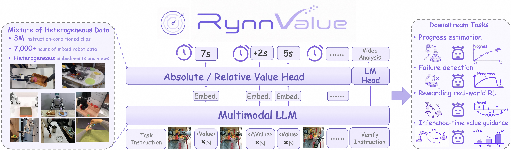
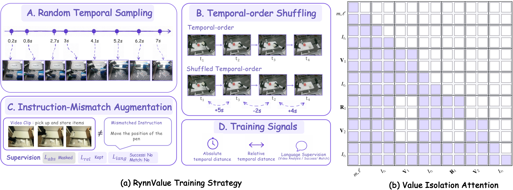
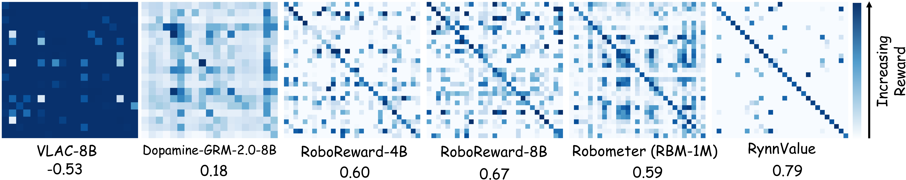
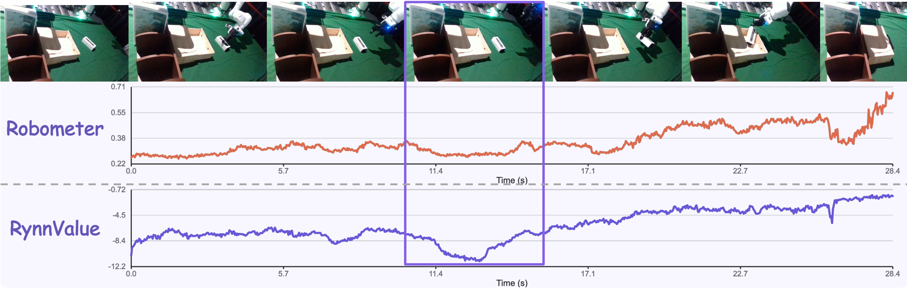
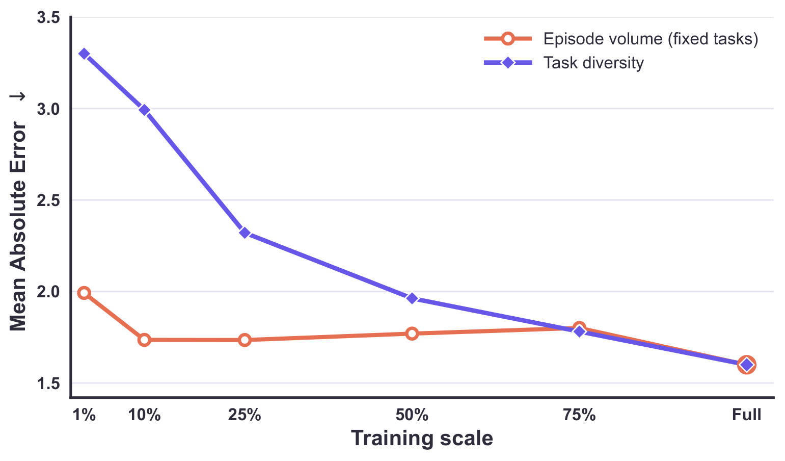
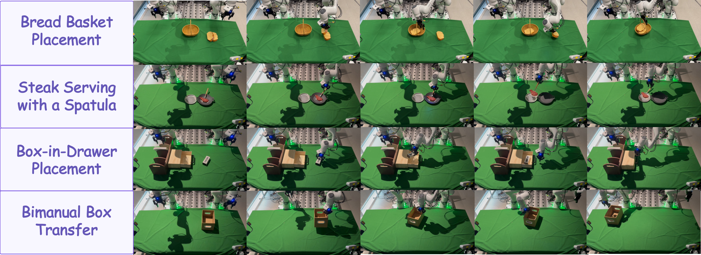

# RynnValue: Scaling Robotic Value Foundation Models with Temporal Distance

<p align="center">
&nbsp;<a href="https://alibaba-damo-academy.github.io/RynnValue.github.io">🏠 Homepage</a>&nbsp; | &nbsp;<a href="https://arxiv.org/abs/2608.09853">📄 arXiv</a>&nbsp; | &nbsp;<a href="https://github.com/alibaba-damo-academy/RynnValue">💻 GitHub</a>&nbsp; | &nbsp;<a href="https://huggingface.co/collections/Alibaba-DAMO-Academy/rynnvalue">🤗 HuggingFace</a>&nbsp; | &nbsp;<a href="https://www.modelscope.cn/collections/DAMO_Academy/RynnValue">🔮 ModelScope</a>&nbsp;
</p>

**A general-purpose value foundation model for robot manipulation — and the full toolchain to evaluate it and use it for reinforcement learning of VLA policies.**

RynnValue is a RynnBrain-based vision-language model (implemented on the Qwen3-VL architecture) that watches a robot video together with a task instruction and predicts, **for every frame**, the **temporal distance** — the *remaining time (in seconds) until the task is completed* — alongside a natural-language analysis of the trajectory (video description, instruction–video match, task success). Because temporal-distance labels are derived directly from timestamps, RynnValue scales to **7,000+ hours** of heterogeneous embodied data (~**3M** instruction-conditioned clips) *without any preference or progress annotations*. The predicted time-to-completion is a dense, task-grounded value signal that can be used directly as a progress estimator, a reward model for policy evaluation and ranking, a critic for reinforcement learning of vision-language-action (VLA) policies, or an offline data curator that filters demonstration frames before behavior cloning.

Trained without a single preference label, RynnValue-8B reaches an average **Kendall's τₐ of 0.704** on RBM-EVAL-OOD — above the fully preference-supervised state of the art (0.655) and more than double a progress-only counterpart (0.292).

<p align="center">
  
</p>

> **Overview.** Given a language instruction and a sequence of sampled observations, RynnValue builds an interleaved multimodal sequence of repeated absolute-value (`<value>`) and relative-value (`<relative_value>`) query groups, encoded by the RynnBrain backbone in a single forward pass. Two distributional heads predict the absolute temporal distance to task completion and the signed relative temporal displacement between observations, while the LM head produces video analysis and task verification. The resulting temporal values serve as a unified interface for progress estimation, failure detection, and reward specification in robotic RL.

This repository bundles the complete stack:

| Component | Directory | What it does |
|---|---|---|
| **RynnValue model** | [`rynn_value/`](rynn_value/) | HuggingFace-compatible model definition (config / model / processor), value heads, value tokenizer, custom attention |
| **Inference demo** | [`rynn_infer/`](rynn_infer/) | Run RynnValue on any video + instruction, render an annotated video with the live remaining-time curve |
| **Reward-model benchmark** | [`robometer/`](robometer/) | Fork of [Robometer](https://arxiv.org/abs/2603.02115) with a `rynnvalue` baseline adapter: reward alignment, policy ranking, and confusion-matrix evaluation, plus an HTTP reward server |
| **VLA policy RL** | [`pi-rl/`](pi-rl/) | Fork of [openpi](https://github.com/Physical-Intelligence/openpi) (π₀ / π₀-FAST / π₀.₅) extended with offline **IQL** fine-tuning, online **DSRL-style SAC** latent steering, and **Filter-BC** progress-filtered fine-tuning, on LIBERO, RoboTwin, and real Franka robots |
| **Tools** | [`tools/`](tools/) | Convert training checkpoints to standalone HuggingFace `trust_remote_code` models |
| **Example** | [`example/`](example/) | Demo video for the inference script |

---

## Table of Contents

- [Highlights](#highlights)
- [How RynnValue Works](#how-rynnvalue-works)
- [Training Recipe](#training-recipe)
- [Results](#results)
- [Repository Structure](#repository-structure)
- [Installation](#installation)
- [Quickstart: Inference](#quickstart-inference)
- [Using RynnValue Programmatically](#using-rynnvalue-programmatically)
- [Evaluation with Robometer](#evaluation-with-robometer)
- [Reward Server](#reward-server)
- [Policy RL with pi-rl](#policy-rl-with-pi-rl)
- [Checkpoint Conversion](#checkpoint-conversion)
- [Model Zoo](#model-zoo)
- [Acknowledgements](#acknowledgements)
- [License](#license)

---

## Highlights

- **Temporal distance as the scaling target.** Instead of preferences or normalized `[0,1]` progress, RynnValue predicts the *goal-conditioned cost-to-go in physical seconds*. Labels come directly from timestamps (plus subtask segmentation and cutoff relabeling), so supervision scales to 7,000+ hours / ~3M clips across 10 heterogeneous data sources (AgiBot, EgoDex, Open X-Embodiment, RoboMIND, RoboTwin, …) without a single preference or progress annotation.
- **State-of-the-art without preference labels.** RynnValue-8B attains an average **Kendall's τₐ of 0.704 on RBM-EVAL-OOD** (4B: 0.679), surpassing the fully preference-supervised state of the art (0.655) and more than doubling a progress-only counterpart (0.292), while generalizing zero-shot to unseen tasks, embodiments, and viewpoints. That 4B is already this strong indicates the gains come from the temporal-distance formulation and its training/architectural designs rather than sheer model scale.
- **Shortcut suppression by design.** *Random temporal sampling* and *temporal-order shuffling* break the correspondence between sequence position / sampling interval and task progress; *value-isolation attention* (`pred_slot_isolated_eager`) keeps each value-query group visible only to its own language–visual context, so predictions can't extrapolate from other value tokens. Ablations (average τₐ, full model 0.704): removing shuffling → **0.159**, uniform sampling → **0.207**, removing value isolation at training time → **0.611**, removing the auxiliary language supervision → **0.622**, removing relative temporal-distance supervision → **0.578**.
- **Train isolated, infer causal.** Value-isolation attention is a *training-time* constraint. At inference RynnValue is queried with a standard causal mask instead, which reuses the default attention kernels and — on paired trajectories — actually ranks better: 0.646 → **0.704** at 8B and 0.614 → **0.679** at 4B. Earlier value states appear to disambiguate the final queried score by carrying trajectory context. See [Policy Ranking: Attention Mask and Value Tokenizer](#policy-ranking-attention-mask-and-value-tokenizer).
- **Quantile value tokenizer.** Frame-level remaining-time labels are extremely skewed (median 11.6 s, 90th percentile 68.7 s, max 636.3 s), so the absolute and relative heads use **256-bin quantile supports** — knots placed at the inverse empirical CDF of 2.17B training-frame labels, covering `[0, 636.3]` s and (mirrored around zero) `[−636.3, 636.3]` s. 119 of the 256 knots fall within 10 s and 217 within 50 s; fixed-interval centers spanning the same range put only ~20 of 256 within 50 s. Targets are **two-hot** encoded and decoded as expected bin centers; the support is frozen across training, fine-tuning, and evaluation, since each knot index is a fixed output-bin identity.
- **Language-grounded analysis.** The model also generates an `Analysis` block: a video description, a *Match: Yes/No* verdict (does the video match the instruction?), and a *Success: Yes/No* verdict. Instruction-mismatch augmentation (10% of training samples) teaches the model to detect instruction–video mismatches instead of always reporting smooth progress.
- **A practical reward interface for real robots.** Converted into dense rewards via potential-based shaping (`Φ_t = −v_t`), RynnValue raises real-world dual-arm Franka policy success from **52.5% → 72.5% online** and **63.8% → 82.5% offline** over the strongest reward-model baseline.
- **Value-based data curation.** Used as an offline filter over pooled multi-task demonstrations, RynnValue lifts multi-task behavior-cloning success from **35.0% → 42.5%** with no target-task adaptation and no critic — see [Filter-BC](#filter-bc-progress-filtered-fine-tuning).
- **Full evaluation + RL loop.** The bundled Robometer fork benchmarks RynnValue against 10+ reward-model baselines (RBM, GVL, ReWiND, RFM, RL-VLM-F, Robo-Dopamine, RoboReward, TopReward, VLAC, …); the pi-rl fork closes the loop by improving π₀.₅ policies with value-driven offline IQL and online SAC, plus a Filter-BC data-curation baseline that trains only on the frames RynnValue scores as making progress.

## How RynnValue Works

```
                ┌────────────────────────────────────────────────────────┐
Instruction ───►│                                                        │
Metadata  ─────►│   RynnBrain backbone (RynnValueLangModel)              │──► Analysis text
Frames  ───────►│                                                        │    (description / Match / Success)
                │  hidden states at repeated query-token positions       │
                └───────┬──────────────────────────────┬─────────────────┘
                        │ <value> group (×N)           │ <relative_value> group (×N)
                        ▼                              ▼
                absolute value head            relative value head
             (256 quantile bins, two-hot)    (256 quantile bins, two-hot)
                        │                              │
                        ▼                              ▼
              remaining time per frame     signed Δt between adjacent frames
```

The architecture follows [the paper](https://arxiv.org/abs/2608.09853) (§3.2, Model Architecture). For each clip the input sequence is

```
x = [ m, ℓ, I₁, V₁, I₂, R₁, V₂, …, I_K, R_{K−1}, V_K, p_ver ]
```

with embodiment metadata `m`, instruction + system prompts `ℓ`, *K* = 8 sampled observations `I`, an absolute-value query group `Vᵢ` of *N* = 8 repeated `<value>` tokens per observation, a relative-value query group `Rᵢ` of *N* = 8 repeated `<relative_value>` tokens between consecutive observations, and a trailing verification prompt `p_ver`.

- **Grouped temporal queries.** A single query token is an information bottleneck; each temporal prediction instead uses a group of *N* = 8 repeated query tokens that attend bidirectionally within the group, and whose hidden states are concatenated (not averaged) before the head, preserving complementary visual cues (object configuration, robot–object interaction, task stage, completion evidence).
- **Dual distributional heads.** The absolute head predicts the remaining time to the (relabeled) completion cutoff; the relative head predicts the signed temporal displacement between consecutively *presented* observations — adjacency in the multimodal sequence, not in the original video, so the target can be negative. Both heads are BroNet residual MLPs (hidden width 4096, depth 8, ReLU) mapping the concatenated `N·d` group representation to 256 bin logits. Targets are two-hot encoded over frozen quantile supports and trained with cross-entropy (so gradients don't scale with temporal error); inference decodes the expected bin center in seconds.
- **Value-isolation attention.** Query groups belonging to different observations cannot attend to each other, and later observation tokens cannot attend to earlier query tokens — each temporal estimate must be grounded in the instruction and visual evidence, and value prediction never leaks into later groups. This mask is a *training-time* constraint: at inference RynnValue is queried with a standard causal mask, which needs no custom kernels and scores better on trajectory ranking (see [Highlights](#highlights)).
- **Language analysis & verification.** A verification prompt after the last query group triggers autoregressive generation of `Video Description → Match → Success` through the LM head. Success prediction is learned purely through this language objective — there is no separate success-classification head.

The prompt (built by `rynn_value/conversations.py`) interleaves an optional embodiment/camera meta block, the task instruction, the two value questions, per-frame images followed by their `<relative_value>` / `<value>` token slots, and finally the analysis request. The processor (`rynn_value/processing_rynn_value_lang.py`) exposes a single-call inference API, `process_episode(instruction, images, robot_description, camera_description)`.

Key implementation files:

| File | Contents |
|---|---|
| `rynn_value/configuration_rynn_value_lang.py` | `RynnValueLangConfig` (extends `Qwen3VLConfig`), `ValueTokenizerConfig` (bins, support transform, encoding), `ValueHeadConfig` (linear / BRO) |
| `rynn_value/modeling_rynn_value_lang.py` | `RynnValueLangModel` — value-head ensemble, relative head, cross-entropy losses over encoded targets, mismatch fusion mask, `RynnValueLangOutputWithPast` |
| `rynn_value/value_tokenizer.py` | Scalar ↔ bin-distribution codec (two-hot / HL-Gauss encoding over `linear` / `symlog` / `quantile` supports) |
| `rynn_value/value_heads.py` | `LinearValueHead`, `BroValueHead` / `BroNet` |
| `rynn_value/attention_impl.py` | `pred_slot_isolated_eager` attention registration |
| `rynn_value/processing_rynn_value_lang.py` | Processor: special tokens, training target construction, `process_episode` inference API |

The package self-registers with HuggingFace Auto classes (`AutoConfig` / `AutoModel` / `AutoProcessor` under model type `rynn_value_lang`), so exported checkpoints load with `trust_remote_code=True` and nothing else.

## Training Recipe

<p align="center">
  
</p>

> **(a) Training strategy.** Random temporal sampling and temporal-order shuffling suppress shortcuts tied to sampling intervals and sequence position, while instruction-mismatch augmentation strengthens language–visual grounding. RynnValue jointly learns absolute temporal distance, relative temporal displacement, and natural-language supervision. **(b) Value-isolation attention.** Within each value-query group, repeated queries attend to one another and to the language–visual context, while remaining isolated from other value-query groups. Colored cells denote visible attention connections.

**Data.** RynnValue is trained on a heterogeneous mixture of real-world, simulated, and egocentric trajectories — 1.67M original episodes expanded into **3.09M instruction-conditioned segments** (7,000+ hours, 223,395 instructions) via subtask segmentation and cutoff relabeling:

| Data Source | # Episodes | # Segments | # Instructions | Segmentation Source |
|---|---:|---:|---:|---|
| Open X-Embodiment | 693,037 | 693,037 | 180,090 | coarse task |
| EgoDex | 338,234 | 338,234 | 2,038 | coarse task |
| InternData-A1 | 320,905 | 320,905 | 348 | coarse task |
| AgiBot | 167,535 | 1,166,042 | 3,741 | subtask |
| RoboCOIN | 67,420 | 410,877 | 2,124 | subtask |
| RoboMIND | 32,138 | 32,138 | 184 | coarse task |
| RoboTwin | 27,414 | 27,414 | 23,527 | coarse task |
| Galaxea Open-World | 16,979 | 95,671 | 11,070 | subtask |
| RDT | 6,109 | 6,109 | 272 | coarse task |
| Soft-FOLD | 1,542 | 1,542 | 1 | coarse task |
| **Total** | **1,671,313** | **3,091,969** | **223,395** | — |

Long demonstrations are split using native temporal annotations where available (`subtask`); otherwise the whole episode is kept as a single coarse segment. Because recorded trajectories often contain post-completion motion, each segment is also assigned a **completion cutoff** — the segment endpoint by default, with dataset-specific ratio- or duration-based trimming where that better approximates the first semantically completed observation.

Temporal-distance labels are then generated directly from timestamps: for frame `t`, cutoff `c`, and frame rate `f`, the target is `v* = max((c − t)/f, 0)` seconds — remaining time before the cutoff, zero at or after it. No dataset-specific progress normalization is needed. Qwen3-VL-27B captions supervise the `Video Description` output and do not affect the temporal targets.

**Objectives.** Three jointly optimized cross-entropy losses, `L = L_abs + L_rel + λ_lang · L_lang` with `λ_lang = 2`: (1) the absolute temporal-distance loss over two-hot bin targets, masked for instruction-mismatched samples (the original cutoff is no longer valid under a substituted instruction); (2) the relative temporal-distance loss, which is instruction-independent and therefore kept for mismatched samples; (3) the causal LM loss over the `Video Description / Match / Success` tokens.

**Shortcut suppression.** For each clip, *K* = 8 observations are sampled at irregular timestamps (random temporal sampling). Temporal-order shuffling is applied with probability 0.5: half of the sequences are independently sampled without sorting, the rest follow a forward-biased temporal walk with rewind probability 0.3 — so relative targets can be negative. Together with value-isolation attention, this forces every prediction to be grounded in the corresponding observation and task semantics. For 10% of samples the instruction is swapped with one from a different trajectory (instruction-mismatch augmentation) and supervised toward `Match: No` / `Success: No`.

**Optimization.** AdamW with lr `1e-6`, `β = (0.9, 0.95)`, weight decay `0.1`, `ε = 1e-8`; constant LR schedule without warm-up, gradient norm clipped at 100. Training runs in bfloat16 with FSDP hybrid sharding and a per-device batch size of 2.

**Quantile support.** The 256 temporal knots are fit once from the frame-level labels of the full training mixture (2,167,034,629 labels, frame-weighted so longer trajectories contribute proportionally more) by sampling the empirical inverse CDF at equally spaced probability levels, with no upper-tail clipping — the last knot is the maximum observed remaining time, 636.33 s. The signed relative support mirrors the same non-negative knots around zero. Knots are stored in float32 and nudged to the next representable value wherever consecutive quantile levels collide, keeping the support strictly increasing; it then stays **frozen** across training stages, fine-tuning runs, and checkpoint evaluation.

| Statistic | Value | | Horizon | Knots | Share |
|---|---:|---|---|---:|---:|
| Frame-level labels | 2,167,034,629 | | ≤ 1 s | 19 | 7.4% |
| Min / max label | 0.00 / 636.33 s | | ≤ 5 s | 75 | 29.3% |
| Mean label | 25.82 s | | ≤ 10 s | 119 | 46.5% |
| 50th / 90th / 99th pct | 11.57 / 68.73 / 181.07 s | | ≤ 50 s | 217 | 84.8% |
| Min / median / max knot spacing | 0.033 / 0.167 / 419.30 s | | ≤ 200 s | 254 | 99.2% |

**Reward interface.** At inference, frames are fed chronologically and decoded into remaining time `v_t`. The potential `Φ_t = −v_t` (negative before completion, approaching zero at the goal) preserves the physical temporal scale rather than normalizing to a task-specific `[0,1]` interval. Downstream RL uses it through potential-based shaping with a retained sparse completion term,

```
r'_t = κ · (γ·Φ_{t+1} − Φ_t) + { 0 if t = T and the trajectory succeeds, else −1 }
```

where `κ` controls shaping strength (0.1 for RynnValue, 1.0 for Robometer in our real-world runs). The sparse term is kept because reward-model predictions can be noisy while the success label is clean.

## Results

**Policy ranking (RBM-EVAL-OOD).** The suite contains 976 trajectories from six out-of-distribution datasets spanning different institutions, embodiments, camera viewpoints, and task families, each annotated with failed / suboptimal / successful execution quality levels. The ranking score is the absolute head's remaining time at the final queried observation, negated (`−v_end`), with instruction-mismatch gating: when the language branch predicts `Match: No` the score is replaced by `−100`. Neither the relative head, the video description, nor the success verdict enters the score. Kendall's τₐ is computed per task, averaged over tasks within a suite, then averaged unweighted over the six suites.

Trained without preference labels, **RynnValue-8B reaches 0.704** and even **RynnValue-4B reaches 0.679** — both above the 0.655 of the full Robometer model trained with progress *and* trajectory-preference supervision, and far above its progress-only ablation (0.292). Among preference-free methods, RynnValue variants are best on all six suites, lifting the strongest prior preference-free average (0.502) to 0.679 / 0.704.

| Method | USC Franka | USC Koch | USC Trossen | USC xArm | MIT Franka | UTD SO101 | **Average** |
|---|---:|---:|---:|---:|---:|---:|---:|
| GVL | 0.250 | −0.008 | 0.292 | 0.056 | 0.306 | 0.300 | 0.199 |
| ReWiND | −0.125 | 0.336 | 0.028 | −0.167 | 0.080 | −0.067 | 0.014 |
| VLAC-2B | 0.292 | 0.167 | −0.111 | 0.167 | −0.017 | −0.033 | 0.077 |
| VLAC-8B | 0.271 | 0.064 | −0.417 | 0.139 | 0.072 | 0.167 | 0.049 |
| RoboDopamine | 0.167 | 0.175 | 0.000 | 0.014 | 0.220 | 0.067 | 0.107 |
| Dopamine-GRM-2.0-8B-Preview | 0.479 | 0.442 | 0.333 | 0.431 | 0.431 | 0.700 | 0.453 |
| RoboReward-4B | 0.625 | 0.332 | 0.333 | 0.528 | 0.494 | 0.700 | 0.502 |
| RoboReward-8B | 0.625 | 0.264 | 0.389 | 0.347 | 0.396 | 0.767 | 0.465 |
| Robometer (RoboReward data) | 0.583 | 0.533 | 0.646 | 0.403 | 0.479 | 0.667 | 0.552 |
| Robometer (RBM-1M) | 0.646 | 0.471 | 0.653 | 0.694 | **0.601** | **0.867** | 0.655 |
| Robometer (progress only) | 0.083 | 0.231 | 0.333 | 0.389 | 0.183 | 0.533 | 0.292 |
| **RynnValue-4B** | 0.542 | **0.645** | **1.000** | 0.500 | 0.518 | **0.867** | 0.679 |
| **RynnValue-8B** | **0.750** | 0.504 | **1.000** | **0.722** | 0.450 | 0.800 | **0.704** |

Kendall's τₐ (↑). Bold marks the best overall result per column; baseline results are taken from Robometer.

**Ablations.** All variants are evaluated at the same training checkpoint; each row removes exactly one component from the full model.

| Variant | Shuffle | Isolation | Language | Random | Relative | **Average τₐ** |
|---|:-:|:-:|:-:|:-:|:-:|---:|
| w/o Shuffle | ✗ | ✓ | ✓ | ✓ | ✓ | 0.159 |
| Uniform sampling | ✓ | ✓ | ✓ | ✗ | ✓ | 0.207 |
| w/o Relative | ✓ | ✓ | ✓ | ✓ | ✗ | 0.578 |
| w/o Isolation | ✓ | ✗ | ✓ | ✓ | ✓ | 0.611 |
| w/o Language | ✓ | ✓ | ✗ | ✓ | ✓ | 0.622 |
| **Full model (8B)** | ✓ | ✓ | ✓ | ✓ | ✓ | **0.704** |

Removing temporal-order shuffling is by far the most damaging (0.159, and negative on MIT Franka) — sequence position becomes a strong proxy for progress again. Uniform sampling is nearly as bad (0.207): regular intervals let the model replay a stereotypical value curve instead of reading the visual content. The remaining three components each contribute 0.08–0.13.

**Instruction–trajectory alignment.** Scoring every instruction against every trajectory, RynnValue produces the clearest diagonal structure with the highest normalized diagonal margin (**0.79** vs. 0.67 for the strongest baseline). All models are re-evaluated under a unified protocol from their publicly released weights:

<p align="center">
  
</p>

**Value-curve quality.** On real-world trajectories, RynnValue reacts sharply to task regressions and recoveries where normalized-progress baselines stay flat. Both curves are oriented so that higher means closer to completion (Robometer emits normalized progress, RynnValue the potential `Φ_t = −v_t`, so the scales are not directly comparable):

<p align="center">
  
</p>

Three differences stand out: **(1)** in the highlighted regression interval RynnValue's potential drops sharply while Robometer responds weakly — a consequence of order shuffling and value isolation grounding predictions in visual evidence; **(2)** after recovery RynnValue climbs steadily, whereas Robometer shows long plateaus and abrupt jumps — the benefit of jointly learning absolute and relative temporal values; **(3)** RynnValue stays sensitive near completion, so late disturbances cause an immediate potential decrease followed by recovery instead of premature reward saturation.

**Scaling behavior.** Task diversity — not episode volume — drives generalization. Two subset families are trained from scratch under identical settings: one subsamples episodes within a fixed task set, the other subsamples tasks at fixed per-task episode counts, so both protocols see a comparable number of episodes at each fraction. Scaling episode count saturates almost immediately, while adding tasks monotonically reduces temporal-distance error on held-out unseen tasks well past the midpoint:

<p align="center">
  
</p>

**Real-world policy learning.** Used as a zero-shot reward annotator (none of the tasks, objects, or scenes appear in training, and no target-domain fine-tuning) on a dual-arm Franka with wrist + two third-person cameras, across four manipulation tasks and 20 trials per task. Offline RL is IQL on mixed-expertise datasets (≈100 successful trajectories per task plus every unsuccessful attempt); online RL is DSRL latent steering, initialized from the per-task SFT checkpoint on Bread / Steak and from the Robometer offline-RL checkpoint on Box-in-Drawer / Bimanual, with that initialization held fixed across reward variants. Both use the same potential-based shaping interface with a retained sparse completion term.

| Algorithm | Reward | Bread Basket | Steak Serving | Box-in-Drawer | Bimanual Transfer | **Average** |
|---|---|---:|---:|---:|---:|---:|
| Online RL | **RynnValue** | **45.0** | **75.0** | **70.0** | **100.0** | **72.5** |
| | Robometer | 35.0 | 45.0 | 65.0 | 65.0 | 52.5 |
| | Sparse | 40.0 | 45.0 | 40.0 | 70.0 | 48.8 |
| Offline RL | **RynnValue** | **100.0** | **90.0** | **90.0** | **50.0** | **82.5** |
| | Robometer | 80.0 | 80.0 | 50.0 | 45.0 | 63.8 |
| | Sparse | 70.0 | 20.0 | 0.0 | 0.0 | 22.5 |
| SFT | — | 70.0 | 25.0 | 0.0 | 0.0 | 23.8 |

Success rate (%). RynnValue is best on all four tasks in both regimes, with the largest margins on Steak Serving (+30 online) and Bimanual Box Transfer (+35 online). It is also more efficient: offline Bread Basket reaches 100% in 16.8 action chunks on average vs. 18.9 for Robometer, and Steak Serving / Box-in-Drawer both reach 90% in 14.9 chunks. RL with RynnValue solves Bimanual Box Transfer, on which multi-task SFT records no successes at all. Online gains on Box-in-Drawer are limited for *both* reward models (65.0 / 70.0, from the 50.0 Robometer offline checkpoint that both online runs start from): the task hinges on grasp stability and box–drawer alignment that third-person RGB alone does not disambiguate.

<p align="center">
  
</p>

**Scalable post-training via data filtering.** Offline and online RL both need task-specific training, so RynnValue is also evaluated as a task-amortized data curator: demonstrations from all four tasks are pooled, every segment is scored, low-quality ones are dropped, and a single multi-task policy is fine-tuned on what survives. Same initialization, same source dataset, same optimization recipe as multi-task SFT — the only difference is the filtering, which isolates the effect of value-based data selection.

| Task | Multi-task SFT | Filtered BC |
|---|---:|---:|
| Bread Basket Placement | 30.0 | **70.0** |
| Steak Serving with a Spatula | 70.0 | **75.0** |
| Bimanual Box Transfer | 0.0 | **25.0** |
| Box-in-Drawer Placement | **40.0** | 0.0 |
| **Average** | 35.0 | **42.5** |

Success rate (%). Filtering is not uniformly positive: Box-in-Drawer drops to zero, most likely the same visual-ambiguity failure as above — with only third-person RGB, useful segments get scored as non-progressing and discarded. Mechanism and launcher in [Filter-BC](#filter-bc-progress-filtered-fine-tuning).

## Repository Structure

```
RynnValue001/
├── rynn_value/                 # RynnValue model package (HF trust_remote_code style)
├── rynn_infer/
│   ├── inference.py            # CLI: video + instruction → value curve + analysis
│   ├── plot_utils.py           # save_video_with_trend(): renders annotated output video
│   └── outputs/                # sample inference outputs
├── robometer/                  # Robometer benchmark fork (reward-model training + eval)
│   ├── robometer/
│   │   ├── configs/            # Hydra configs (reward_model/rynnvalue.yaml, distributed/fsdp.yaml, …)
│   │   ├── models/             # RBM (progress/preference/success heads), ReWiND transformer
│   │   ├── evals/              # run_baseline_eval.py, eval/baseline servers, baselines/rynnvalue.py
│   │   ├── data/ trainers/     # dataset + training code
│   ├── rynnvalue_eval/         # RynnValue-specific eval launchers (policy ranking, confusion matrix, server)
│   ├── eval_commands/          # eval commands for the other baselines
│   ├── dataset_upload/         # converters to the RBM HF dataset format (LIBERO, AgiBotWorld, custom)
│   └── train.py                # reward-model training entry (accelerate + FSDP, LoRA)
├── pi-rl/                      # openpi fork + RL
│   ├── src/openpi/             # π₀ / π₀.₅ models (JAX + PyTorch), training, RL data loading
│   ├── scripts/                # train.py, train_iql.py, serve_policy.py, launch scripts
│   ├── configs/                # RL configs (SAC, TD, DAgger, EXPO)
│   ├── examples/               # libero, droid, aloha, dsrl_sim, dsrl_franka, franka (real robot), …
│   ├── packages/openpi-client/ # websocket policy client
│   └── third_party/jaxrl2/     # vendored jaxrl2 (pi_iql, pixel_iql, pixel_sac)
├── tools/
│   └── convert_rynn_value_lang_to_hf.py   # training ckpt → standalone HF model
└── example/
    └── Put_the_box_in_the_drawer_and_close_it.mp4
```

## Installation

Each component manages its own environment. Python 3.10 is required throughout.

### RynnValue inference (`rynn_value` + `rynn_infer`)

Managed with [uv](https://docs.astral.sh/uv/) via the top-level `pyproject.toml`:

```bash
uv sync                     # creates .venv with torch / transformers / imageio / …
```

A recent `transformers` with Qwen3-VL support is required (pinned in `pyproject.toml`). A single GPU with ≥ 24 GB memory comfortably runs the 8B model in bf16.

### Robometer evaluation

```bash
cd robometer
uv sync                     # Python 3.10, uv-managed (see pyproject.toml / uv.lock)
```

See `robometer/README.md` and `robometer/FINETUNE_ROBOMETER.md` for dataset download, reward-model fine-tuning (LoRA + FSDP), and the full baseline matrix.

### pi-rl

```bash
cd pi-rl
GIT_LFS_SKIP_SMUDGE=1 uv sync           # JAX 0.5.3 (cuda12), flax, torch 2.7.1, lerobot, …
```

GPU requirements follow upstream openpi: > 8 GB for inference, > 22.5 GB for LoRA fine-tuning, > 70 GB (A100/H100) for full fine-tuning. See `pi-rl/README.md`.

## Quickstart: Inference

Run RynnValue on the bundled example video:

```bash
cd rynn_infer
uv run python inference.py \
    --model_path Alibaba-DAMO-Academy/RynnValue-8B \
    --video_path ../example/Put_the_box_in_the_drawer_and_close_it.mp4 \
    --instruction "Put the box in the drawer and close it" \
    --robot_description "a Franka single-arm robot" \
    --camera_description "the main right camera" \
    --num_frames 8 \
    --output_path ./outputs
```

Useful flags:

| Flag | Default | Meaning |
|---|---|---|
| `--num_frames` | 64 | Frames uniformly sampled from the video (0 = all frames) |
| `--robot_description` / `--camera_description` | None | Embodiment/camera meta block (required for models trained with `use_meta=True`) |
| `--max_new_tokens` | 128 | Token budget for the Analysis block |
| `--fps` | 30 | FPS of the rendered trend video |

The script produces, in a timestamped output directory:

- `output_with_trend.mp4` — the input video with a synchronized **Remaining Time (s)** curve;
- the parsed Analysis (video description, `Match: Yes/No`, `Success: Yes/No`) and per-frame values.

## Using RynnValue Programmatically

```python
import torch
from transformers import AutoConfig, AutoModel, AutoProcessor

model_path = "/path/to/RynnValue-8B"

config = AutoConfig.from_pretrained(model_path, trust_remote_code=True)

model = AutoModel.from_pretrained(
    model_path, config=config, torch_dtype=torch.bfloat16,
    trust_remote_code=True, device_map="cuda",
    # Causal masking is what the reported numbers use. The value-isolation mask
    # (`pred_slot_isolated_eager`) is a training-time device and ranks worse at
    # inference; omitting this argument takes whatever `config.json` records.
    attn_implementation="sdpa",
).eval()
processor = AutoProcessor.from_pretrained(model_path, trust_remote_code=True)

# `images`: list of PIL.Image frames sampled from the trajectory video
inputs = processor.process_episode(
    instruction="Put the box in the drawer and close it",
    images=images,
).to(model.device)

with torch.no_grad():
    out = model(**inputs)

remaining_time = out.value.pred_value.float().mean(dim=0)    # (num_frames,) seconds, averaged over value heads
delta_time     = out.relative.pred_value                     # (num_frames,) signed time deltas
entropy        = out.value.entropy.mean(dim=0)               # (num_frames,) distributional uncertainty
```

## Evaluation with Robometer

The `robometer/` fork adds RynnValue as a first-class baseline (`robometer/robometer/evals/baselines/rynnvalue.py`, Hydra config `reward_model=rynnvalue`). Ready-made example commands live in `robometer/rynnvalue_eval/` (plus `start_server.sh` for the reward server).

**Policy ranking** (does the value model rank better policies higher?) — example commands in `rynnvalue_eval/policy_ranking.sh`; the released-model run:

```bash
cd robometer
ROBOMETER_PROCESSED_DATASETS_PATH=/path/to/processed_datasets \
python robometer/evals/run_baseline_eval.py \
    'reward_model=rynnvalue' \
    'model_path=Alibaba-DAMO-Academy/RynnValue-8B' \
    'custom_eval.eval_types=[policy_ranking]' \
    'custom_eval.policy_ranking=[rbm-1m-ood]' \
    'custom_eval.use_frame_steps=false' \
    'custom_eval.pad_frames=false' \
    'custom_eval.num_examples_per_quality_pr=1000' \
    'max_frames=8' \
    'model_config.checkpoint_path=null' \
    'model_config.mode=absolute' \
    'model_config.stride=2' \
    'model_config.num_frames=8' \
    'model_config.attn_implementation=sdpa' \
    'model_config.camera_desc_lookup_path=./extracted_meta_with_descriptions.json'
```

Two optional `model_config` fields: `camera_desc_lookup_path=extracted_meta_with_descriptions.json` supplies the per-trajectory camera descriptions used by RBM-EVAL-OOD, and `attn_implementation` (`sdpa` / `eager` / `pred_slot_isolated_eager`) selects the inference-time attention mask. Set it explicitly rather than relying on the default: left unset, the run takes whatever the checkpoint's own `config.json` records, which is not the same across checkpoint generations. `sdpa` is the causal mask the reported numbers use; `pred_slot_isolated_eager` reproduces the value-isolation rows of the table below. To evaluate a fine-tuned raw checkpoint instead, set `model_config.checkpoint_path=/path/to/checkpoint_model_XXXXXX` (a `model.pt` directory whose sibling `huggingface/` holds the processor/config artifacts).

**Confusion matrix** (cross-task instruction/video matching) — example commands in `rynnvalue_eval/confusion_matrix.sh`, one per scoring mode (`model_config.confusion_score_mode`):

- `match_binary` — score 1.0 iff the Analysis verdict is `Match: Yes`;
- `normalized_value` — the value head normalized to `[0, 1]` (`1 − t/t_max`) on matches, 0 otherwise.

```bash
cd robometer
ROBOMETER_PROCESSED_DATASETS_PATH=/path/to/processed_datasets \
python robometer/evals/run_baseline_eval.py \
    'reward_model=rynnvalue' \
    'model_path=Alibaba-DAMO-Academy/RynnValue-8B' \
    'custom_eval.eval_types=[confusion_matrix]' \
    'custom_eval.confusion_matrix=[[...dataset ids...]]' \
    'max_frames=8' \
    'model_config.stride=2' \
    'model_config.num_frames=8' \
    'model_config.camera_desc_lookup_path=./extracted_meta_with_descriptions.json' \
    'model_config.confusion_score_mode=match_binary'
```

See `robometer/eval_commands/` for the other baselines. Dataset converters for LIBERO, AgiBotWorld, and custom datasets (DROID / Bridge style) live in `robometer/dataset_upload/`.

### Policy Ranking: Attention Mask and Value Tokenizer

Two knobs change the ranking score without any retraining: the **value tokenizer** the temporal head was trained with, and the **inference-time attention mask**. Every row below was trained with value-isolation attention; paired rows differ only in the mask used at inference, on the same checkpoint and the same processed trajectories (`max_frames=8`, `stride=2`, `num_frames=8`, per-trajectory camera descriptions).

| Params | Value tokenizer | Inference attention | USC Franka | USC Koch | USC Trossen | USC xArm | MIT Franka | UTD SO101 | **Average** |
|---|---|---|---:|---:|---:|---:|---:|---:|---:|
| 8B | normalized | value-isolation | 0.583 | 0.416 | 0.778 | 0.500 | 0.493 | 0.733 | 0.584 |
| 4B | quantile | value-isolation | 0.583 | 0.485 | 0.931 | 0.500 | 0.450 | 0.733 | 0.614 |
| 8B | quantile | value-isolation | 0.667 | 0.437 | 0.972 | 0.556 | 0.442 | 0.800 | 0.646 |
| 8B | normalized | causal mask | 0.583 | 0.635 | 0.806 | 0.639 | 0.475 | 0.867 | 0.667 |
| 4B | fixed bins | causal mask | 0.542 | 0.488 | 0.917 | 0.667 | 0.473 | **0.933** | 0.670 |
| 8B | fixed bins | causal mask | 0.667 | 0.544 | **1.000** | 0.500 | 0.503 | 0.833 | 0.675 |
| 4B | quantile | causal mask | 0.542 | **0.645** | **1.000** | 0.500 | **0.518** | 0.867 | 0.679 |
| **8B** | **quantile** | **causal mask** | **0.750** | 0.504 | **1.000** | **0.722** | 0.450 | 0.800 | **0.704** |

Kendall's τₐ. The last row is the headline configuration reported in [Results](#results).

**Attention.** Value isolation lets queries interact *within* a prediction group but blocks their representations from later observation and value groups; the causal mask opens that path at inference, so later queries can read earlier value-query states (though not their decoded scalars). On paired trajectories this consistently helps: 0.646 → 0.704 (8B quantile), 0.614 → 0.679 (4B quantile), 0.584 → 0.667 (8B normalized). Earlier value states appear to disambiguate the final queried score by carrying trajectory context, though terminal-score ranking alone cannot establish better *frame-level* distance estimates or sensitivity to local regression. Note this is *not* the same intervention as the `w/o Isolation` ablation in [Results](#results), which removes the mask during training and drops the average to 0.611 — that one permits the cross-group shortcut throughout learning.

**Value tokenizer.** Frame-level labels are strongly skewed (median 11.57 s, 90th percentile 68.73 s, max 636.33 s), which motivates non-uniform resolution: 119 of 256 quantile centers fall within 10 s and 217 within 50 s, whereas only ~20 of the same 256 centers land within 50 s when spaced at fixed intervals up to the same maximum. Normalized progress changes the target scale altogether — the same episode fraction can mean different remaining durations, weakening the shared cost-to-go interpretation. On the mean, 8B quantile beats normalized under isolation (0.646 vs. 0.584) and beats both normalized and fixed bins under a causal mask (0.704 vs. 0.667 / 0.675). The suite-level picture is mixed, though: normalized 8B leads on USC Koch, and fixed-bin 4B leads on USC xArm and UTD SO101. Fixed bins may help at long horizons and normalized progress where fraction-completed matters; label density is a plausible account of the mean advantage rather than a demonstrated cause of every per-suite difference.

**Reproducing a row.** `bash rynnvalue_eval/policy_ranking.sh [sdpa|eager|isolated]` selects the inference mask: `sdpa` (the default) is the causal mask applied through Transformers' built-in scaled dot-product attention backend and reproduces the last row of the table above for the released 8B quantile checkpoint; `isolated` keeps the training-time value-isolation mask (`pred_slot_isolated_eager`); `eager` runs the same causal mask through the eager kernel. The script always passes the mask explicitly. If you invoke `run_baseline_eval.py` directly, do the same — left unset, the model falls back to whatever its own `config.json` records, which is not the same across checkpoint generations.

## Reward Server

Serve RynnValue as an HTTP reward model (used by policy evaluation and online RL clients):

```bash
cd robometer
bash rynnvalue_eval/start_server.sh \
    --model-path /path/to/RynnValue-8B \
    --port 8001 --gpu 0 --num-frames 8 --batch-size 16
```

The server (`robometer/robometer/evals/baseline_eval_server.py`) accepts frame sequences + instructions and returns per-frame values / rewards. `--checkpoint-path` alternatively loads a raw training checkpoint (`model.pt` with a sibling `huggingface/` snapshot). `--mode absolute` selects the remaining-time head; `--debug` attaches `debugpy` on `:5678`.

## Policy RL with pi-rl

`pi-rl/` is a fork of [openpi](https://github.com/Physical-Intelligence/openpi) that turns value/reward signals into better VLA policies. On top of upstream π₀ / π₀-FAST / π₀.₅ SFT (JAX and PyTorch), it adds:

- **Offline IQL fine-tuning** (`scripts/train_iql.py`): each step (1) updates a jaxrl2 `PixelIQL` critic/value, (2) computes the IQL advantage, (3) updates the π₀.₅ flow-matching policy with advantage-weighted BC (`exp(A_scaling · adv)`). RL-aware plumbing lives in `src/openpi/training/{rl_data_loader,iql_checkpoints,episode_filter}.py`. Registered configs include `pi05_robotwin_iql`, `pi05_franka_single_iql`, `pi05_franka_dual_iql`, and variants.
- **Online DSRL-style SAC latent steering**: a small `PixelSAC` agent steers the frozen π₀.₅ policy's latent noise online — in simulation (`examples/dsrl_sim/`, LIBERO `OffScreenRenderEnv`) and on a real Franka over WebSocket (`examples/dsrl_franka/`).
- **Filter-BC (filtered behavior cloning)**: a data-curation baseline that needs no critic and no policy-side conditioning. RynnValue labels every demonstration frame with a `progress` score; frames whose λ-discounted progress return over a W-step window does not exceed a per-repo threshold are dropped, and the surviving frames train as plain BC (`src/openpi/training/progress_advantage.py`, config `pi05_franka_mixed_filter_bc`). See [Filter-BC](#filter-bc-progress-filtered-fine-tuning).
- **Benchmarks & robots**: LIBERO, RoboTwin, ALOHA sim, DROID, and a full real-Franka pipeline (`examples/franka/`: serving, fine-tuning, async online LoRA training) with LeRobot-format data converters (`scripts/convert_franka_data_to_lerobot.py`).

Representative commands:

```bash
cd pi-rl

# supervised fine-tuning on RoboTwin
FSDP_DEVICES=2 bash scripts/train_pi05_robotwin.sh adjust_bottle-demo_clean_collect_200-50

# offline IQL on RoboTwin
bash scripts/train_iql_robotwin.sh

# Filter-BC on mixed single-arm + dual-arm Franka repos
bash scripts/train_pi05_franka_mixed_filter_bc.sh
```

### Filter-BC: Progress-Filtered Fine-Tuning

Filtered behavior cloning uses RynnValue purely as an offline **data curator** — no critic, no value function, no policy-side conditioning. Every demonstration frame carries a `progress` label `p_t ∈ [0, 1]`; the per-frame reward is the progress increment `r_t = p_{t+1} − p_t` and the filtering score is the λ-discounted return over a `W`-step window,

```
A_t = Σ_{k=0..W−1} λ^k · r_{t+k},    with r ≡ 0 past the episode end
```

A frame is kept iff `A_t > τ_repo` (strictly), so under the default `"zero"` criterion only frames that make some forward progress within the next `W` steps survive. The kept frames then train as **plain BC** with the task prompt only. Thresholds and frame whitelists are computed once from the lerobot parquet `progress` columns and cached under `assets/<config>/<asset_id>/`, with the criterion, `W`, quantile and λ all encoded into the cache filename so a changed setting never reuses a stale whitelist.

```bash
cd pi-rl

# default: W=50, lambda=0.98, criterion=zero over the config's repo_ids
bash scripts/train_pi05_franka_mixed_filter_bc.sh

# your own progress-labeled dumps (norm stats must already exist for this override)
REPO_IDS="/data/close_the_drawer,/data/pick_up_the_box" SKIP_NORM=1 \
    bash scripts/train_pi05_franka_mixed_filter_bc.sh

# keep only the top-30% of frames by windowed advantage, over a wider window
ADVANTAGE_HORIZON=128 ADVANTAGE_CRITERION=quantile ADVANTAGE_QUANTILE=0.7 \
    bash scripts/train_pi05_franka_mixed_filter_bc.sh
```

`pi05_franka_mixed_sft` is the unfiltered control arm — same mixed single-arm + dual-arm 16-dim action layout, same prompt, same hyperparameters, but every frame trains. The two runs isolate the effect of progress filtering. `pi05_franka_mixed_filter_bc` needs repos that carry a `progress` feature (the RynnValue-labeled dumps); `pi05_franka_mixed_sft` does not.

On the four real Franka tasks, this filter with its default criterion (`λ = 0.98`, `W = 50`, keep `A_t > 0`) lifts multi-task BC success from 35.0% to **42.5%** over the unfiltered arm — see [Results](#results) for the per-task breakdown.

### DSRL Online RL on a Real Franka

`examples/dsrl_franka/` runs online SAC latent steering on a real (single- or dual-arm) Franka, optionally shaped by a RynnValue reward server. The launcher template is `examples/dsrl_franka/scripts/run_train_franka.sh`; the flow is:

**1. (Optional) Start the RynnValue reward server** for reward shaping (see [Reward Server](#reward-server)):

```bash
cd robometer && bash rynnvalue_eval/start_server.sh --model-path /path/to/RynnValue-8B --port 8000
```

**2. Start the robot environment server** (WebSocket) on the machine controlling the Franka, or skip this and use `--fake_env` for a quick dry run without hardware.

**3. Launch online training.** Point it at an IQL-initialized checkpoint (`FRANKA_SFT_CKPT_BASE`) and the env/reward servers:

```bash
cd pi-rl
export FRANKA_SFT_CKPT_BASE=/path/to/iql_checkpoint/10000   # offline-IQL warm start
export XLA_PYTHON_CLIENT_PREALLOCATE=false

python examples/dsrl_franka/launch_train_franka.py \
    --arm_mode dual \
    --policy_config pi05_franka_dual_iql_optimized_v2 \
    --update_type episode --utd_ratio 100 --publish_hz 10.0 \
    --client_host localhost --client_port 8101 \
    --pi0_action_horizon 16 \
    --franka_norm_stats_asset_id pick_up_the_box \
    --max_episodes 500 --franka_max_timesteps 600 \
    --start_online_updates 200 \
    --noise_episodes 2 --noise_std 0.1 \
    --score_server "http://localhost:8000" \
    --shaping_weight 1.0 --shaping_gamma 0.999 \
    --task_description "Move the box from the right side to the left side." \
    --checkpoint_interval 200 --checkpoint_dir ./experiments/dual_reward_shaping \
    --wandb_project dsrl_franka --seed 42
```

Key knobs:

| Flag | Meaning |
|---|---|
| `--arm_mode single/dual` (+ `--side left/right`) | Single- or dual-arm Franka |
| `--fake_env` | Local fake environment — verify the training loop without a robot |
| `--client_host` / `--client_port` | WebSocket address of the robot env server |
| `--score_server` | RynnValue/Robometer reward server URL; enables potential-based reward shaping (`--shaping_weight`, `--shaping_gamma`) |
| `--update_type episode` / `--utd_ratio` | Update after each episode with the given update-to-data ratio |
| `--noise_episodes` / `--noise_std` | Initial exploration episodes with Gaussian latent noise |
| `--start_online_updates` | Warm-up steps collected before SAC updates begin |

The same recipe runs in simulation via `examples/dsrl_sim/launch_train_sim.py` (LIBERO `OffScreenRenderEnv`).

See `pi-rl/README.md` for upstream documentation (checkpoints under `gs://openpi-assets/checkpoints/`: `pi05_base`, `pi05_libero`, `pi05_droid`, …), norm-stat computation, and policy serving.

## Checkpoint Conversion

Export a raw training checkpoint to a standalone HuggingFace model directory (embeds the modeling code for `trust_remote_code` loading):

```bash
uv run python tools/convert_rynn_value_lang_to_hf.py \
    --model_ckpt_path /path/to/checkpoint_model_XXXXXX \
    --output_path /path/to/RynnValue-8B-hf \
    --dtype bf16
```

`--model_ckpt_path` expects a directory containing `model.pt` with the matching `huggingface/` processor/config snapshot next to it.

## Model Zoo

| Model | Backbone | RBM-EVAL-OOD τₐ | Description |
|---|---|---:|---|
| [`RynnValue-4B`](https://huggingface.co/Alibaba-DAMO-Academy/RynnValue-4B) | [RynnBrain-4B](https://huggingface.co/Alibaba-DAMO-Academy/RynnBrain-4B) | 0.679 | Remaining-time value model with absolute + relative distributional heads and Analysis generation |
| [`RynnValue-8B`](https://huggingface.co/Alibaba-DAMO-Academy/RynnValue-8B) | [RynnBrain-8B](https://huggingface.co/Alibaba-DAMO-Academy/RynnBrain-8B) | **0.704** | Remaining-time value model with absolute + relative distributional heads and Analysis generation |

Both checkpoints are also mirrored on [ModelScope](https://www.modelscope.cn/collections/DAMO_Academy/RynnValue). Load them with `trust_remote_code=True`, as in [Using RynnValue Programmatically](#using-rynnvalue-programmatically).

## Acknowledgements

This repository builds on outstanding open-source work:

- [**openpi**](https://github.com/Physical-Intelligence/openpi) (Physical Intelligence) — π₀ / π₀-FAST / π₀.₅ VLA models and training stack (Apache-2.0; `pi-rl/`).
- [**Robometer**](https://arxiv.org/abs/2603.02115) — "Scaling General-Purpose Robotic Reward Models via Trajectory Comparisons": benchmark, RBM baselines, and the RBM-1M dataset (`robometer/`).
- [**jaxrl2**](https://github.com/ikostrikov/jaxrl2) — IQL / SAC agents (vendored in `pi-rl/third_party/jaxrl2/`).
- [**RynnBrain**](https://github.com/alibaba-damo-academy/RynnBrain) - Open Embodied Foundation Models
- [**Qwen3-VL**](https://github.com/QwenLM/Qwen3-VL) — the underlying vision-language architecture of the RynnBrain backbone.
- Simulation benchmarks: [LIBERO](https://github.com/Lifelong-Robot-Learning/LIBERO), [RoboTwin](https://github.com/TianxingChen/RoboTwin), [DROID](https://droid-dataset.github.io/), gym-aloha.

## License

- The RynnValue components (`rynn_value/`, `rynn_infer/`, `tools/`) are distributed under the **Apache License 2.0** (see [`LICENSE`](LICENSE)).
- `pi-rl/` is distributed under the **Apache License 2.0** (see `pi-rl/LICENSE`) with additional Gemma terms in `pi-rl/LICENSE_GEMMA.txt`.
- `robometer/` follows the upstream Robometer project under the **MIT License** (see `robometer/LICENSE`). It additionally vendors FSDP utilities derived from ByteDance's [verl](https://github.com/volcengine/verl) project (Apache-2.0; original copyright headers retained in `robometer/robometer/utils/fsdp/`).

## Citation

If you find RynnValue useful, please cite [our paper](https://arxiv.org/abs/2608.09853):

```bibtex
@article{huang2026rynnvalue,
  title   = {RynnValue: Scaling Robotic Value Foundation Models with Temporal Distance},
  author  = {Huang, Dongchi and Zhang, Hongyin and Hou, Bohan and Huang, Siteng and
             Su, Zhian and Guo, Hang and Lu, Tong and Tang, Jiahao and Yang, Jianfei and
             Wang, Donglin and Peng, Peixi and Chen, Mingxiu and Zhao, Deli and Li, Xin},
  journal = {arXiv preprint arXiv:2608.09853},
  year    = {2026},
  doi     = {10.48550/arXiv.2608.09853},
  url     = {https://arxiv.org/abs/2608.09853}
}
```

This repository is also citable as software via [`CITATION.cff`](CITATION.cff).
